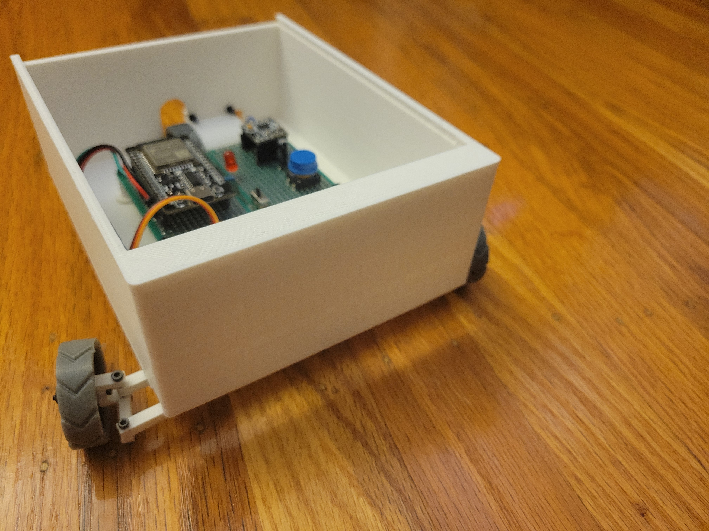
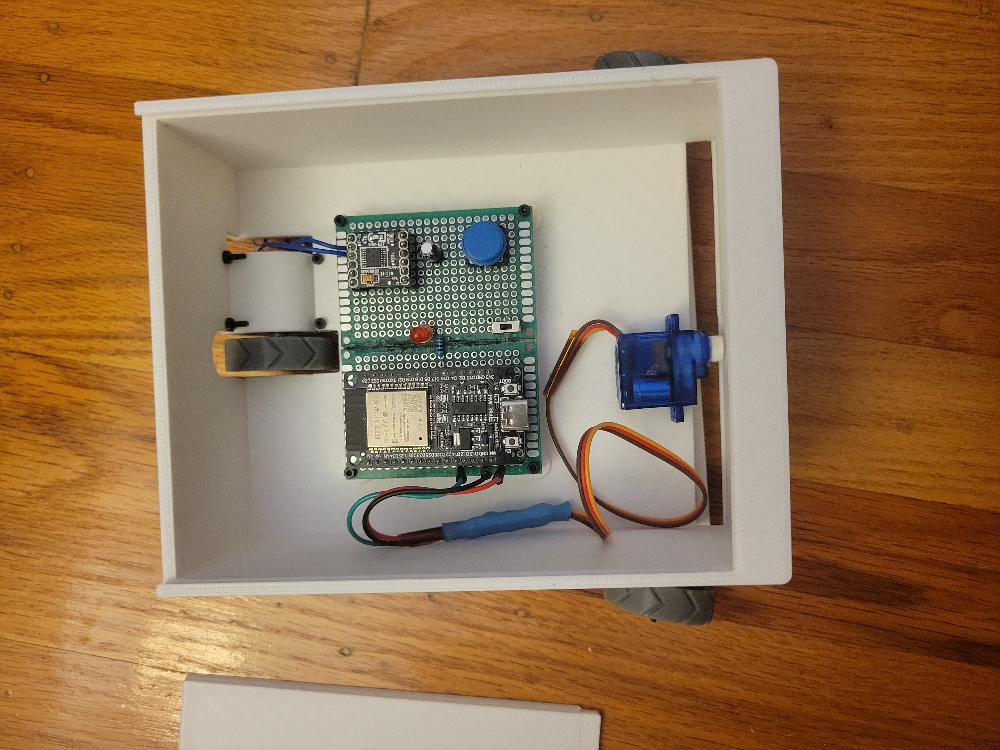
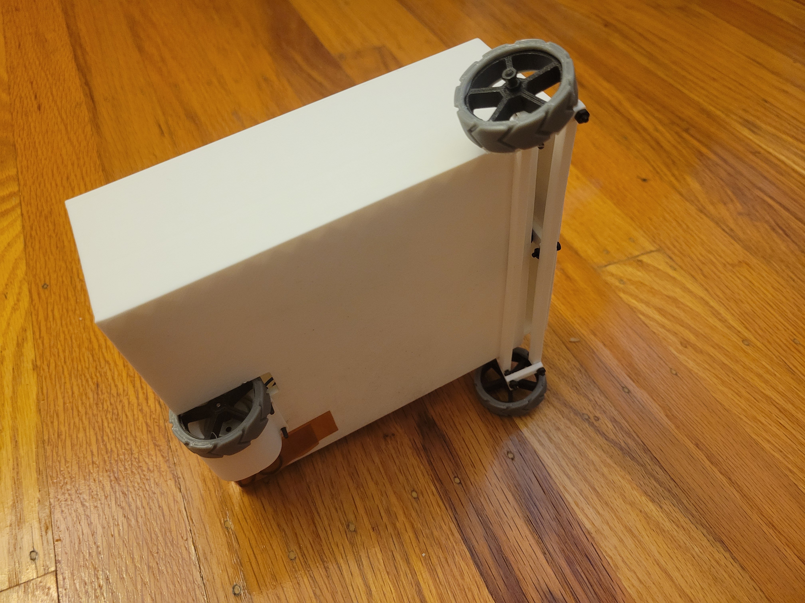
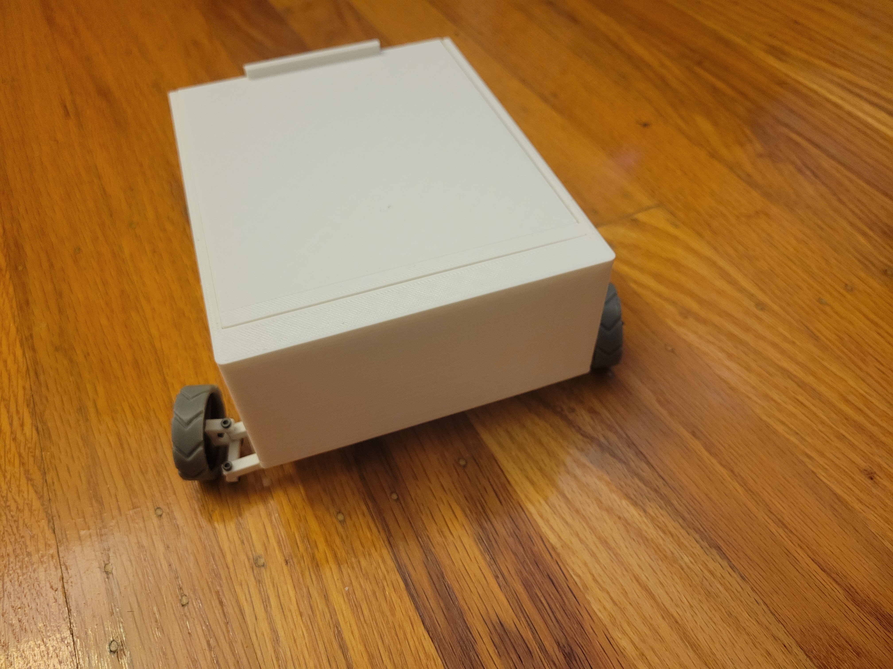

# Bluetooth Car with React Native app
## by Nicholas Hong and Owen Lee

### Description:
Our goal was to create a RC Car with Bluetooth compatiblity
instead of a receiver and transmitter. 

### Central:
1. React Native Bluetooth App

### Peripheral Parts:
1. ESP32: microcontroller
2. DRV8833: motor bridge
3. small Mabuchi motor
4. 180-degree Servo

### Power:
1. 2x Samsung 8A 35e
2. V8 18650 shield

### Case:
1. All 3d printed parts. STLs included in files

#### Here are some images:

### Final Thoughts:
It was a fun summer project and we learned plenty of new things.
This was our first time doing our own circuitry without guidance.
It was more difficult than we initially thought as we are both not trained in 
electrical engineering. Troubleshooting the parts was difficult since we did not
have the correct equipment, an oscilloscope, to understand what channels and 
frequencies to use.

